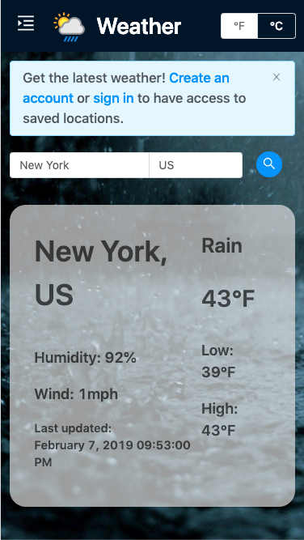

# [Weather App](https://weather-kevinlee6.herokuapp.com/)

Stay up-to-date with the latest weather! Search weather conditions of different cities over the world with data provided from OpenWeatherMap. Create an account to save/organize locations.

  

## Tech Stack

- Front-End

  - React (with create-react-app)
  - Redux / Thunk (State Management)
  - React Router
  - Styled Components (CSS-in-JS)
  - React Drag-and-Drop
  - Formik (Manage form data)
  - Moment (handle timezones)
  - Antd UI Library
  - Axios (make HTTP requests)

- Back-End

  - Ruby on Rails
    - RSpec/Factory Bot for basic unit testing for database/model level
  - Postgres (DBMS)
  - Bcrypt (hash password)
  - Json Web Token (within HTTP-only cookie) as authentication system

- APIs: OpenWeatherMap

## Database Architecture

There are three tables: users, locations, and user_locations.

1. Users have standard email/password authentication combo, with password hashing taken care of with bcrypt. Users are authenticated through JWTs within a HTTP-only cookie. Within the JWT is the email of the user, which will be used against the database to verify it it exists.

2. Locations has three properties: city, country, and city id. City id is not the same as it's primary-key id; instead it is sourced from OpenWeatherMap during creation. Notably, certain (very few) cities share the same city_id, and the same city can have different city_ids if different querying methods are used, such as zip code vs city name. For this reason, specific zip code querying is not used, but it will be accepted as a city name parameter to maintain consistency of city_id. This is a large flaw, so in the future city_id will probably be replaced with a more unique identifier while putting more or less same strain on database querying.

3. User-locations (saved locations / favorites) is a join-table between Users and Locations. It contains ids of the associated user and location, and also has a priority attribute which is used to sort/organize locations on the frontend.

## Design considerations

The front end and back end run on separate servers. It is more modular this way; I actually started this project with MERN stack but felt like I needed to use some joins/relations. The frontend portion was directly transferred from the old project to this project with little to no changes. I could have used Express/Postgres combo, but wanted to expand/refresh on Rails knowledge.

The site is expected to be mobile responsiveness; only tested mobile displays from Chrome Developer Tools' Device Toolkit.

Redux was used as state management store since there are many components communicating with each other and overall easier to manage after writing the boilerplates. Redux thunk handled asynchronous requests, and custom middleware was written to reduce some boilerplate of such asynchronous actions.

Ideally, I would have liked to verify backend changes before doing any frontend changes, but there is a very slight lag (rubber-banding in the case of drag and drop locations) since it hits the database before redux store. For this reason, some methods update redux store before database and optimistically expects a database commit.

There is no schema.rb because I wanted to experiment with Postgres enums data type. Because it is tailored for Postgres/not a general data type, schema.rb could not dump the locations table so structure.sql is used instead.

There may be a scalability issue as database grows, specifically user_locations table and the priority column. To maintain order and reorder the list of saved cities, the worst-case scenario is that the whole priority column would need to be updated with new values (either plus or minus one). A solution is to limit the number of cities a user can save, such as through subscription model.

## Future thoughts

As the app scales, I would store OpenWeatherMap's results into my own database, so I query their database less, as calls are limited especially with the free plan. Current weather can be expanded to 5-day weather using cards to display information.
